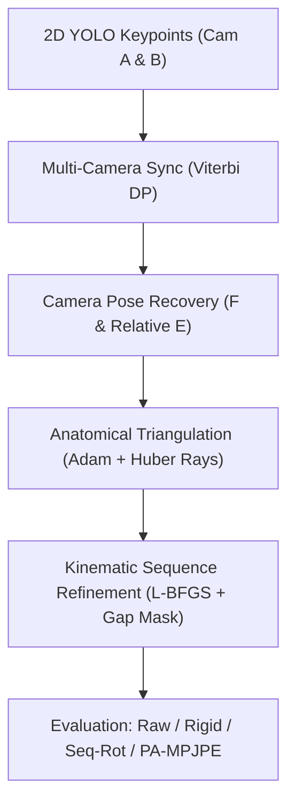

# Kiến Trúc Và Giải Pháp Kỹ Thuật (AthletePose3D 2-Camera)

Tài liệu mô tả chi tiết toàn bộ thiết kế kiến trúc toán học và mã nguồn của hệ thống phục dựng tư thế 3D từ 2 camera không hiệu chuẩn trước, áp dụng trên bộ dữ liệu thể thao tốc độ cao **AthletePose3D**.

---

## 1. Luồng Xử Lý Toàn Cục (End-to-End Pipeline)

Mô hình hoạt động theo 4 giai đoạn độc lập nhưng liên kết chặt chẽ:

---

## 2. Chi Tiết Các Mô-đun Toán Học & Thuật Toán

### 2.1. Đồng bộ hoá Động Hai Camera (Dynamic Viterbi DP Synchronization)
- **Tập tin**: [`src/athlete_pose3d/algorithms/synchronization.py`](../src/athlete_pose3d/algorithms/synchronization.py)
- **Vấn đề**: Các camera trong thể thao ghi hình độc lập, không có tín hiệu phần cứng genlock. Độ lệch thời gian giữa 2 camera có thể trôi (`drift`) nhẹ qua các pha vận động.
- **Giải pháp**:
  1. Tính ma trận chi phí biểu kiến $C(t, \Delta)$ dựa trên độ tin cậy và sự phù hợp hình học giữa các khớp 2D:
     $$C(t, \Delta) = \frac{1}{\sum_j w_j} \sum_{j} w_j \cdot \|x_1(t, j) - \tilde{x}_2(t+\Delta, j)\|$$
  2. Dùng Quy hoạch động Viterbi (Viterbi Dynamic Programming) tìm quỹ đạo offset tối ưu $\Delta_t$ toàn cục:
     $$\min_{\{\Delta_t\}} \sum_{t} C(t, \Delta_t) + w_{trans} \cdot |\Delta_t - \Delta_{t-1}|$$
     với $w_{trans} = 7.5$. Toàn bộ ma trận chi phí chuyển trạng thái $|\Delta_i - \Delta_j|$ được tiền tính toán ngoài vòng lặp thời gian để tối ưu tốc độ.
  3. **Khóa quỹ đạo mượt**: Đặt `sync_local_radius: 0` khi truy xuất frame để sử dụng trực tiếp kết quả đường đi mượt của DP, loại bỏ hoàn toàn rung lắc pha frame-to-frame.

### 2.2. Khôi phục Tham số Camera Tương đối (Relative Pose Recovery)
- **Tập tin**: [`src/athlete_pose3d/algorithms/uncalibrated.py`](../src/athlete_pose3d/algorithms/uncalibrated.py)
- **Nguyên lý**:
  1. Ước lượng Ma trận Cơ bản $F$ (Fundamental Matrix) từ các tương ứng điểm 2D chuẩn hóa qua chuẩn 8-điểm cải tiến kết hợp lọc RANSAC.
  2. Xấp xỉ ma trận nội tại $K$ từ kích thước video và góc nhìn danh định ($f = f_{scale} \times W$).
  3. Phân rã ma trận thiết yếu $E = K_2^T F K_1$ bằng SVD thành ma trận xoay tương đối $R$ và tịnh tiến $t$ (chuẩn hóa $\|t\|=1$).
  4. Giải tỷ lệ metric thực tế bằng cách so khớp khoảng cách khớp 3D tái tạo với chiều cao đã hiệu chuẩn của vận động viên (`solve_metric_scale`).

### 2.3. Tam giác đạc Giải phẫu (Anatomical Triangulation)
- **Tập tin**: [`src/athlete_pose3d/algorithms/geometry.py`](../src/athlete_pose3d/algorithms/geometry.py)
- **Hàm tối ưu**: Khởi tạo từ $X_0 = \text{DLT}(P_1, P_2, x_1, x_2)$, giải bài toán tối ưu phi tuyến bằng thuật toán Adam với tốc độ học `lr` có thể cấu hình (mặc định 0.1):
  $$\mathcal{L}_{anat}(X) = \sum_{c \in \{1, 2\}} \sum_{j=1}^{17} w_{c, j} \cdot \mathcal{H}_\delta(d(X_j, \text{ray}_{c, j})) + w_{bone} \cdot \sum_{(u, v) \in \mathcal{B}} \mathcal{H}_\delta(|\|X_u - X_v\| - L_{uv}^*|)$$
  - $\text{ray}_{c, j}$: Tia camera được tiền tính toán một lần từ tâm quang học và điểm ảnh 2D (`_camera_rays`).
  - $\mathcal{H}_\delta$: Hàm Huber Loss ($\delta = 5.0\text{ mm}$ cho khoảng cách tia, $\delta = 10.0\text{ mm}$ cho độ dài xương) giúp kháng nhiễu khi detector 2D bị che khuất hoặc trượt khớp.
  - $L_{uv}^*$: Chiều dài xương chuẩn H36M scaled theo chiều cao chính xác của từng VĐV:
    - **S1**: 1591.0 mm (nữ trượt băng nghệ thuật)
    - **S2**: 1553.0 mm
    - **S3**: 1733.0 mm (nam)

### 2.4. Tối ưu Chuỗi Động học Thời gian với Mặt nạ Khoảng trống (Kinematic Refinement with Gap Masking)
- **Tập tin**: [`src/athlete_pose3d/algorithms/refinement.py`](../src/athlete_pose3d/algorithms/refinement.py)
- **Khai thác tính liên tục thời gian**: Hệ thống trích xuất cửa sổ khung hình liên tục tại tâm clip (`contiguous window`). Khi có frame bị lọc bỏ do điểm động học cao hoặc độ tin cậy thấp, mặt nạ khoảng trống (`gap masking`) bảo đảm các số hạng thời gian chỉ áp dụng cho các frame thực sự liên tiếp:
  $$\text{gap\_ok}_t = \mathbb{I}(\text{frame}_{t+1} - \text{frame}_t = 1)$$
- **Hàm mất mát chuỗi (L-BFGS)**:
  $$\mathcal{L}_{seq} = \mathcal{L}_{data} + w_{bone} \cdot \mathcal{L}_{bone} + w_{sym} \cdot \mathcal{L}_{sym} + w_{smooth} \cdot \mathcal{L}_{accel} + w_{vel} \cdot \mathcal{L}_{vel}$$
  - **Mất mát Gia tốc (Acceleration)**:
    $$\mathcal{L}_{accel} = \sum_{t=1}^{T-2} \mathcal{H}_\delta(X_{t-1} - 2X_t + X_{t+1}) \cdot (\text{gap\_ok}_{t-1} \cdot \text{gap\_ok}_t) \quad (w_{smooth} = 0.15)$$
  - **Mất mát Vận tốc (Velocity)**:
    $$\mathcal{L}_{vel} = \sum_{t=1}^{T-1} \mathcal{H}_\delta(X_t - X_{t-1}) \cdot \text{gap\_ok}_t \quad (w_{vel} = 0.03)$$
  - **Mất mát Đối xứng xương (Symmetry)**:
    $$\mathcal{L}_{sym} = \sum_{(u_L, v_L), (u_R, v_R)} |\|X_{u_L} - X_{v_L}\| - \|X_{u_R} - X_{v_R}\|| \quad (w_{sym} = 0.12)$$

---

## 3. Cấu Trúc Mã Nguồn và Điểm Truy Cập

| Mô-đun | Đường dẫn | Chức năng cốt lõi |
| :--- | :--- | :--- |
| **Pipeline CLI** | [`src/athlete_pose3d/main.py`](../src/athlete_pose3d/main.py) | Entry point chính; xử lý cờ `-S1, -S2, -S3, --overwrite`. |
| **Orchestrator** | [`src/athlete_pose3d/pipeline.py`](../src/athlete_pose3d/pipeline.py) | Điều phối luồng xử lý frame, trích xuất camera pairs, reset state khi nhảy frame. |
| **Cấu hình** | [`src/athlete_pose3d/settings.py`](../src/athlete_pose3d/settings.py) | Schema cấu hình YAML và xác thực ràng buộc thời gian. |
| **Hình học** | [`src/athlete_pose3d/algorithms/geometry.py`](../src/athlete_pose3d/algorithms/geometry.py) | DLT có trọng số, Adam Anatomical, hàm Huber ray loss, 4 thước đo MPJPE. |
| **Chuỗi thời gian** | [`src/athlete_pose3d/algorithms/refinement.py`](../src/athlete_pose3d/algorithms/refinement.py) | L-BFGS multi-frame optimizer với gia tốc, vận tốc và gap masking. |
| **Đồng bộ** | [`src/athlete_pose3d/algorithms/synchronization.py`](../src/athlete_pose3d/algorithms/synchronization.py) | Viterbi DP Dynamic Sync, đánh giá lựa chọn cặp camera tối ưu. |
| **Báo cáo** | [`src/athlete_pose3d/io/reporting.py`](../src/athlete_pose3d/io/reporting.py) | Xuất báo cáo Raw, Rigid, Seq-Rot, PA-MPJPE và chẩn đoán cấp chuỗi. |
