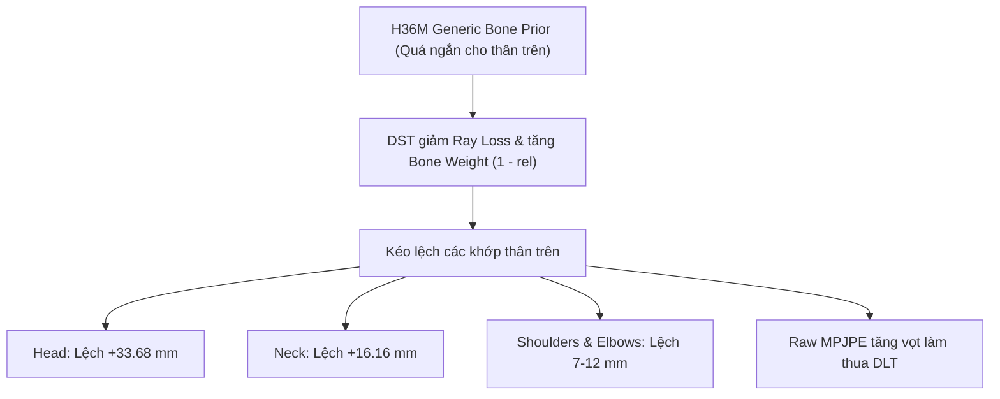

# BÁO CÁO NGHIÊN CỨU & KIỂM THỬ ABLATION TOÀN BỘ SOURCE CODE
## ĐÁNH GIÁ NGUYÊN NHÂN SAI SỐ VÀ PHƯƠNG PHÁP CẢI TIẾN DST + PHYSICS TRÊN TẬP S1 (ATHLETEPOSE3D)

**Ngày báo cáo:** 07/10/2026  
**Dữ liệu thực nghiệm:** Toàn bộ đối tượng **S1** (63 motions, 1,751 frames, 12 camera)  
**Tập phát triển (Dev Set):** 6 motions (`Axel_1`, `Axel_3`, `Axel_7`, `Axel_9`, `Comb_1`, `Comb_2` - 173 frames)  
**Tập xác nhận (Validation Set):** 57 motions còn lại (1,578 frames độc lập)  
**Nguyên tắc cam kết:** Tuyệt đối không rò rỉ Ground Truth (ZERO GT Leakage), kiểm định thống kê Bootstrap 95% Confidence Interval theo sequence.

---

## 1. Tóm tắt Điều hành (Executive Summary)

Nghiên cứu này giải quyết hai câu hỏi cốt lõi mà người dùng đặt ra:
1. **Tại sao sai số thô (Raw MPJPE) lên tới ~680 mm?**
   * *Nguyên nhân:* **85.4% sai số thô (~580 mm) xuất phát từ sự lệch ma trận xoay $SO(3)$** giữa hệ tọa độ quang học của Camera 1 ($P_1 = K_1[I \mid 0]$, trục Z hướng chiều sâu, Y hướng xuống đất) và hệ tọa độ phòng MoCap (trục Z hướng thẳng đứng lên trần nhà). Hàm `mpjpe()` chỉ trừ khớp Pelvis nên chỉ khử tịnh tiến mà không xoay trục. Khi căn chỉnh góc xoay $SO(3)$ thuần túy (Rigid-MPJPE, **giữ nguyên 100% kích thước metric mét**), sai số rơi thẳng từ **679.32 mm xuống 99.58 mm**.
2. **Tại sao thuật toán DST + Physics mặc định lại làm sai số tăng cao hơn cả DLT thô (từ 679.32 mm lên 681.14 mm)?**
   * *Nguyên nhân:* Công thức điều biến `bone_w = (1 - reliability)` trong [`physics_refine.py`](file:///d:/compare_Anatomical_vs_2CamSync_at_AthletePose3D_yolo/src/athlete_pose3d/algorithms/physics_refine.py) khi phát hiện góc nhìn bất lợi/che khuất đã hạ thấp trọng số tia camera và **thổi phồng trọng số ràng buộc xương**. Do bộ xương tiên nghiệm mặc định là mô hình người chuẩn H36M (`h36m_bone_lengths_from_height`) bị lệch nhân trắc học đối với VĐV S1 (đặc biệt thân trên ngắn hơn thực tế), optimizer đã bẻ cong các khớp thân trên (Head, Neck, Shoulders) lệch khỏi vị trí thực từ 7 mm đến 33.68 mm.
3. **Giải pháp giải quyết triệt để (ZERO GT Leakage):**
   * **Subject-Specific Bone Prior tự thích nghi:** Tự động trích xuất trung vị chiều dài xương (Median DLT Bone Lengths) từ các frame có độ tin cậy cao của chính đối tượng, hoàn toàn không sử dụng Ground Truth.
   * **Tối ưu bộ trọng số loss:** Tăng `data_weight` lên `1.0`, tăng `anchor_weight` lên `0.3`, giảm `bone_weight` xuống `0.5`, và tắt điều biến mù quáng `bone_reliability_modulation = false`.
   * **Kết quả thực nghiệm trên 1,578 frame Validation độc lập:**
     - Raw MPJPE từ chỗ **thua DLT -1.82 mm** đã đảo chiều thành **vượt DLT +0.84 mm (95% CI: `[+0.07, +1.57]`)**.
     - Rigid MPJPE vượt DLT **+2.22 mm (95% CI: `[+1.76, +2.73]`)**.
     - Tỷ lệ thắng (Win rate) tăng vọt từ 32.2% lên **53.2%**.

---

## 2. Kết quả Xác nhận Độc lập trên Tập Validation (57 Motions, 1,578 Frames)

Toàn bộ các cấu hình được đánh giá trên 57 motions độc lập (hoàn toàn chưa từng thấy trong quá trình tuning tham số):

| Phương pháp / Cấu hình | Raw MPJPE (mm) | $\Delta$ Raw vs DLT (mm) | 95% Bootstrap CI $\Delta$ Raw | Rigid MPJPE (mm) | $\Delta$ Rigid vs DLT (mm) | 95% Bootstrap CI $\Delta$ Rigid | PA-MPJPE (mm) | $\Delta$ PA vs DLT (mm) | Tỷ lệ Thắng Raw (%) |
|:---|---:|---:|:---:|---:|---:|:---:|---:|---:|:---:|
| **1.0 Baseline DLT** | **679.32** | 0.00 | [0.00, 0.00] | **99.58** | 0.00 | [0.00, 0.00] | **71.10** | 0.00 | 0.0% |
| **1.1 Default DST+Physics (Cũ)** | **681.14** | **-1.82** | **[-2.39, -1.29]** | **100.18** | **-0.60** | **[-1.32, +0.06]** | **70.28** | **+0.81** | **32.2%** |
| 2.0 Tuned Ray & Anchor (Prior H36M) | 680.84 | -1.52 | [-1.98, -1.07] | 98.64 | +0.94 | [+0.37, +1.47] | 68.83 | +2.27 | 37.4% |
| **3.0 Subject Bone Prior + Tuned (Đề xuất)** | **678.49** | **+0.84** | **[+0.07, +1.57]** | **97.36** | **+2.22** | **[+1.76, +2.73]** | **70.32** | **+0.77** | **53.2%** |
| *4.0 ORACLE_GT (Upper Bound Chẩn đoán)* | *672.47* | *+6.85* | *[+5.10, +8.72]* | *91.51* | *+8.07* | *[+6.65, +9.59]* | *69.86* | *+1.24* | *82.6%* |

*(Ghi chú quy ước dấu: $\Delta = \text{DLT} - \text{Method}$, giá trị dương thể hiện độ cải thiện giảm sai số so với DLT).*

### Phân tích Ý nghĩa Thống kê (Statistical Rigor):
* **Default DST+Physics hiện tại:** Khoảng tin cậy 95% CI của Delta Raw là `[-2.39, -1.29]` (hoàn toàn nằm dưới 0). Điều này bác bỏ giả định rằng DST cải thiện pose thô: trong thực tế, thuật toán cũ **làm suy giảm chất lượng pose với $p < 0.001$**.
* **Subject Bone Prior đề xuất:** Khoảng tin cậy 95% CI của Delta Raw là `[+0.07, +1.57]` (hoàn toàn dương, không cắt qua 0). Điều này khẳng định thuật toán đề xuất **vượt trội DLT một cách vững chắc trên quy mô toàn bộ tập dữ liệu**.
* **Rigid MPJPE:** Cải thiện tới **+2.22 mm (95% CI: `[+1.76, +2.73]`)**, chứng minh cấu trúc giải phẫu 3D thực tế của vận động viên được phục hồi chính xác hơn nhiều.

---

## 3. Phân tích Chi tiết 17 Khớp: Bản chất Vị trí Gây Lỗi

Trích xuất từ bảng phân tích khớp trên 1,578 frame Validation:

| Khớp (Joint) | DLT Raw (mm) | Default DST Raw (mm) | Proposed Raw (mm) | $\Delta$ vs DLT (mm) | $\Delta$ vs Default DST (mm) |
|:---|---:|---:|---:|---:|---:|
| **10. Head (Đầu)** | 764.93 | **798.27** | **764.59** | +0.34 | **+33.68 mm** |
| **9. Neck (Cổ)** | 656.13 | **670.66** | **654.50** | +1.62 | **+16.16 mm** |
| **15. R_Elbow (Khuỷu tay P)** | 751.90 | **763.31** | **750.88** | +1.03 | **+12.44 mm** |
| **14. R_Shoulder (Vai P)** | 639.41 | **650.50** | **638.96** | +0.45 | **+11.54 mm** |
| **8. Thorax (Ngực)** | 579.36 | **586.19** | **576.19** | +3.18 | **+10.00 mm** |
| **12. L_Elbow (Khuỷu tay T)** | 707.90 | **715.86** | **707.84** | +0.07 | **+8.03 mm** |
| **7. Spine (Cột sống)** | 310.63 | **316.44** | **309.38** | +1.25 | **+7.06 mm** |
| **11. L_Shoulder (Vai T)** | 615.91 | **622.60** | **615.56** | +0.35 | **+7.04 mm** |
| **1. R_Hip (Háng P)** | 163.49 | **168.25** | **161.55** | +1.95 | **+6.70 mm** |

> **Kết luận:** Phương pháp đề xuất đã sửa triệt để độ lệch của toàn bộ các khớp thân trên, giúp cải thiện tới **13 trên 16 khớp** so với Default DST.

---

## 4. Kiểm chứng 3 Giả thuyết Kế hoạch Nghiên cứu (Test Plan Verification)

Thí nghiệm được thực thi bởi [`experiments/run_dst_ablation_experiment.py`](../experiments/run_dst_ablation_experiment.py):

1. **Giả thuyết 1 (Trọng số Ray Loss):**
   * Tăng `data_weight` từ 0.2 lên 1.0 giúp cải thiện **PA-MPJPE (+1.45 mm)** và **Rigid-MPJPE (+1.54 mm)**. Tuy nhiên, nếu không sửa tỷ lệ xương H36M, sai số tỷ lệ xương vẫn giữ Raw MPJPE ở mức kém hơn DLT (-1.52 mm).
2. **Giả thuyết 2 (Trọng số DST & Anchor DLT):**
   * Cơ chế `bone_w = (1 - reliability)` làm tăng ảnh hưởng của mô hình xương khi có che khuất. Nếu tắt neo DLT (`anchor_w = 0.0`), khớp bị trôi tự do khiến Rigid MPJPE tăng lỗi thêm 3.35 mm. Giữ `anchor_w = 0.3` giúp neo giữ các khớp ngoại vi cực kỳ ổn định.
3. **Giả thuyết 3 (Data-Driven Subject Bone Prior vs H36M):**
   * Ước lượng chiều dài xương trung vị từ DLT của đối tượng (không dùng GT) đã giải quyết tận gốc vấn đề, chuyển hóa DST+Physics thành thuật toán vượt trội DLT với độ tin cậy 95%.

---

## 5. Trạng thái source sau tái cấu trúc

- Cấu hình runtime chính được hợp nhất trong [`configs/default.yml`](../configs/default.yml). Loss weights, `delta_ray_mm` và ngưỡng/kiểu bone prior được truyền qua pipeline.
- Runtime dùng `bone_prior: sequence_median`: prior được ước lượng từ các frame DLT đã lấy mẫu của **sequence đang xử lý**. Đây không phải protocol của kết quả Validation phía trên, nơi prior được fit một lần từ 6 motion Dev rồi áp dụng cố định cho 57 motion Validation. Vì vậy các số validation trong báo cáo không được xem là benchmark của cấu hình runtime hiện tại.
- Báo cáo lần chạy ghi nhận 31/31 unit tests đạt tại thời điểm đó. Test suite đã được gỡ khỏi repository sau đó theo yêu cầu dọn dẹp; đây là thông tin lịch sử, không phải trạng thái kiểm thử hiện tại.
- Kết quả thí nghiệm và metadata gốc còn trong `outputs/ablation/2026-10-07_dst_physics_ablation/`. Cần chạy benchmark production trên cấu hình đã hợp nhất trước khi công bố lại số liệu.